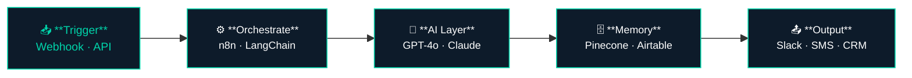

# Ahmad Ali Khan

**Flutter Developer & AI Integration Specialist**

*Helping startups ship faster with Flutter and AI automation*

---

## About Me

Flutter Developer with 2+ years shipping cross-platform apps across mobile, web, SaaS, and IoT — and the AI systems that power them.

I don't just call APIs and display results. I've built a canvas engine driven by Claude's structured JSON output, multi-agent content pipelines, RAG document systems, and voice agents that book appointments over the phone — all shipped for real clients.

- 🔭 Currently building at **Winibex**
- 🌍 Based in **Lahore, Pakistan**
- 💬 Ask me about **Flutter, Firebase, AI Integration, n8n, LangChain**
- 📩 Reach me at **ahmadkhan222000@gmail.com**
- 🚀 Open to **full-time roles & freelance contracts** — remote or Lahore

---

## Tech Stack

**Mobile & Web**

**Backend & DevOps**

**AI & Automation**

---

## Featured Projects

| Project | Description | Stack |
|---|---|---|
| [KitAura](https://github.com/Ahmad-Ali-121/KitAura) | AI-powered document builder SaaS — custom canvas engine, Claude API, Stripe billing | Flutter · Firebase · Claude API · Stripe |
| [Urban Jungle](https://github.com/Ahmad-Ali-121/urban-jungle) | IoT companion app for smart plant-pod system — live sensor data, grow light scheduling | Flutter · WebSockets · MQTT · Riverpod · Hive |
| [AI Lead Qualification](https://github.com/Ahmad-Ali-121/ai-lead-qualification-system) | GPT-4o lead scoring pipeline — HOT/WARM/COLD routing, Gmail outreach, Airtable CRM | n8n · GPT-4o · Airtable · Gmail · Slack |
| [RAG Document Q&A](https://github.com/Ahmad-Ali-121/rag-document-qa) | PDF ingestion to Pinecone, GPT-4o grounded answers, 0.75 confidence gate | n8n · Pinecone · OpenAI · Google Drive |

---

## How I Build Flutter Apps

```mermaid
flowchart LR
    A[📋 **Requirements**] --> B[🏗️ **Architecture**<br/>Clean Arch · Riverpod · Bloc]
    B --> C[🎨 **UI & State**<br/>Flutter · Widgets · Animations]
    C --> D[🔌 **API & Backend**<br/>Firebase · REST · WebSockets]
    D --> E[🧪 **Testing**<br/>Unit · Widget]
    E --> F[🚀 **Deploy**<br/>GitHub Actions · Vercel]

    style A fill:#0D1B2A,color:#00D4AA,stroke:#00D4AA,font-size:12px
    style B fill:#0D1B2A,color:#ffffff,stroke:#00D4AA,font-size:11px
    style C fill:#0D1B2A,color:#ffffff,stroke:#00D4AA,font-size:11px
    style D fill:#0D1B2A,color:#ffffff,stroke:#00D4AA,font-size:11px
    style E fill:#0D1B2A,color:#ffffff,stroke:#00D4AA,font-size:11px
    style F fill:#0D1B2A,color:#ffffff,stroke:#00D4AA,font-size:11px
```

## How I Build AI Automation Systems

---

## GitHub Stats

  

 

 

---

*Open to full-time Flutter roles and freelance contracts — remote worldwide or on-site/hybrid in Lahore*

